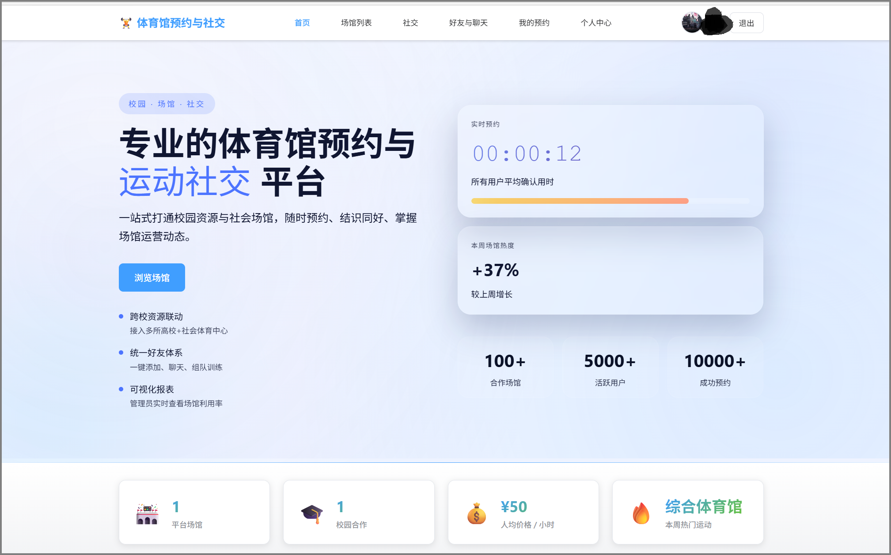
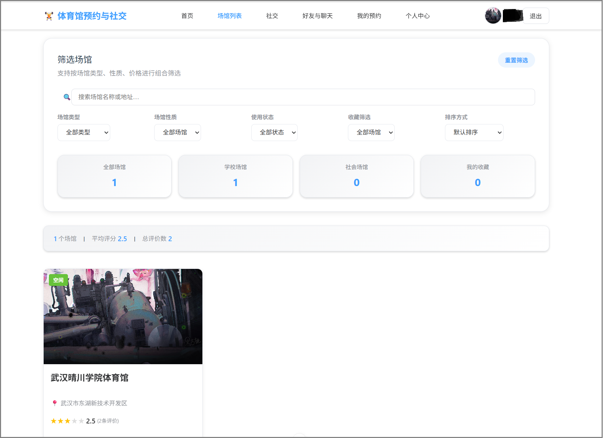
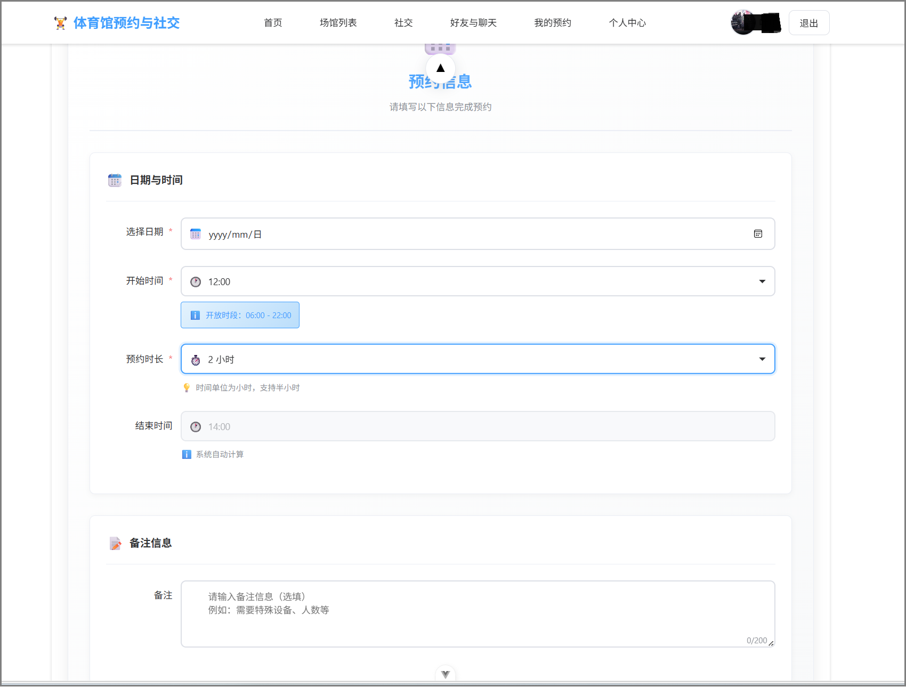
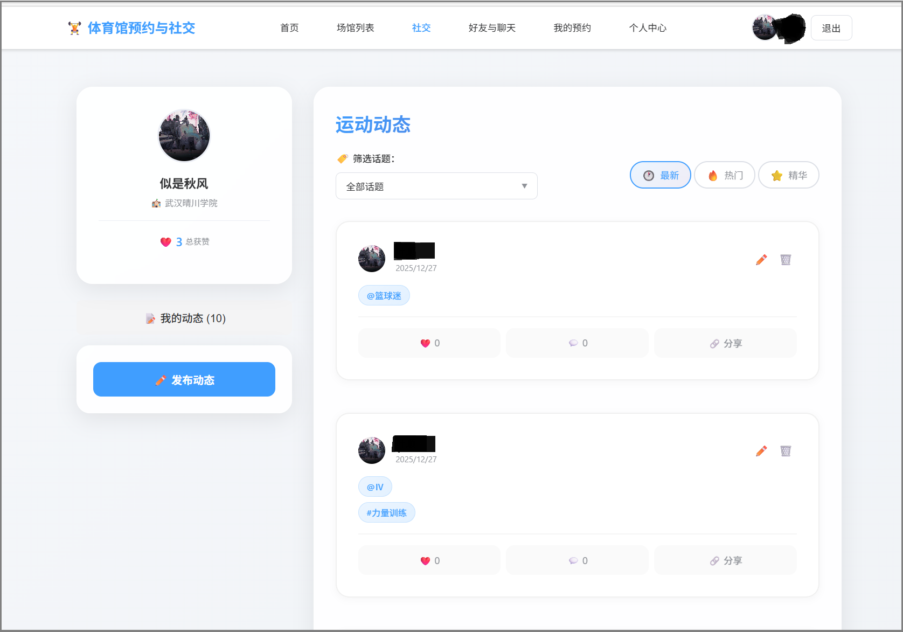

# 体育馆预约与社交平台
## 项目简介
基于 SpringBoot + Vue3 + WebSocket 开发的高校体育馆一站式平台，集成**场馆预约、运动社交、即时聊天、后台管理**四大核心能力，解决传统校园场馆预约流程繁琐、无运动社交渠道的痛点。
- 开发语言：Java 17 / JavaScript
- 架构：前后端分离 SPA 单页面应用
- 实时通讯：WebSocket + STOMP + SockJS
- 持久层：Spring Data JPA + MySQL 8.0

## 功能模块
1. 用户认证模块：注册、登录、Token鉴权、权限控制（学生/管理员）
2. 场馆预约模块：场馆筛选、收藏、时段预约、预约冲突校验、预约记录管理
3. 社交互动模块：发布图文动态、点赞、评论、话题订阅、热门动态
4. 好友聊天模块：好友申请、好友管理、实时私聊、已读回执、在线状态
5. 管理员后台：用户/场馆/动态管理、预约数据统计、学校配置管理

## 技术栈
### 前端
- Vue3 + Vue Router + Pinia 状态管理
- Element Plus UI组件库
- Axios 网络请求
- Stomp.js + SockJS 实时通讯

### 后端
- Spring Boot 2.7
- Spring Security 权限认证
- Spring WebSocket
- Spring Data JPA
- Lombok 简化实体类
- MySQL 8.0

## 项目截图
### 登录注册页面

### 首页

### 场馆预约


### 社交动态

### 即时聊天

### 管理员后台


## 环境部署
### 后端启动
1. 创建MySQL数据库 `gym_platform`，执行docs下sql脚本
2. 修改 `application.yml` 数据库账号密码
3. 启动 SpringBoot 主类，默认端口8080

### 前端启动
```bash
# 安装依赖
npm install
# 本地运行
npm run dev
# 打包部署
npm run build
